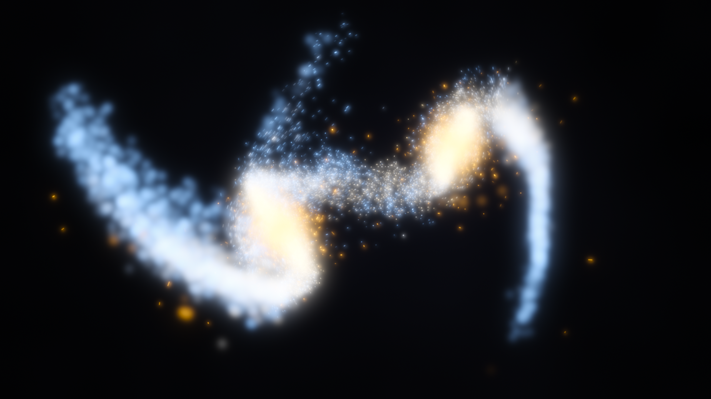

# Galaxy Collision — a gravitational N-body simulation of a merging pair of spirals



A from-scratch collisionless N-body code: exponential stellar disks with Hernquist
bulges inside **live** dark-matter halos, Newtonian gravity with Plummer softening
evaluated by a **Barnes–Hut octree JIT-compiled with numba**, advanced by a
**symplectic kick–drift–kick leapfrog**. Two Milky-Way-like galaxies are put on a
prograde, moderately eccentric encounter and followed for 2.2 Gyr, through first
pericentre, tidal tails and a bridge, a second passage, and the merger into a
pressure-supported remnant.

**72,000 particles · 1,500 steps · 2.2 Gyr · 7.2 minutes on 4 CPU cores ·
max |ΔE|/|E₀| = 1.4 × 10⁻³ · measured integrator convergence order 2.0005**

Everything below — every number, every figure, the still and the film — is
produced by `make all` from an empty checkout. Nothing is quoted from the
literature except where explicitly cited as a model choice.

---

## Headline results

| Quantity | Measured value |
|---|---|
| Particles | 72,000 (2 × 36,000: 15,000 disk + 4,000 bulge + 17,000 live halo) |
| Integrated time | 2.2 Gyr in 1,500 steps of 1.467 Myr |
| Wall clock (4 cores) | **7.16 min**, 274 ms/step, **3.80 µs per step per particle** |
| Barnes–Hut speed-up vs exact O(N²) | **22.5×** at θ = 0.7, same machine, same JIT |
| Energy conservation | max \|ΔE\|/\|E₀\| = **1.40 × 10⁻³**, bounded (see below) |
| Angular-momentum conservation | max \|ΔL\|/\|L₀\| = **1.10 × 10⁻³** |
| Integrator convergence order (measured) | **2.0005** (Kepler ladder, 5 timesteps) |
| Force error at θ = 0.7 | median 3.3 × 10⁻³, 99th pct 3.2 × 10⁻² |
| First pericentre | 16.7 kpc at t = 0.352 Gyr |
| Nuclei merge (separation < 2 kpc) | t = **1.030 Gyr** |
| Longest tidal tail | **130 kpc** at t = 1.54 Gyr |
| Disk → remnant shape (c/a) | **0.216 → 0.516** |
| Stellar mass beyond 30 kpc at t = 2.2 Gyr | 8.4 % |

The single most interesting number is the last pair: the progenitors start as
thin disks with minor-to-major axis ratio c/a = 0.216 and the merger remnant
ends up at c/a = 0.516 with b/a = 0.745 — a triaxial, pressure-supported
spheroid. The simulation reproduces, from Newtonian gravity alone, the classic
result that major mergers of spirals destroy disks and make ellipticals.

---

## 1. Units

Code units are the GADGET set: **kpc**, **10¹⁰ M⊙**, **km/s**. Then

```
G    = 43007.1 kpc (km/s)² / 10¹⁰ M⊙
1 time unit = 1 kpc / (km/s) = 0.9778 Gyr
```

Velocities come out directly in km/s, which keeps rotation curves readable.
Time is converted to Gyr only at the reporting boundary (`src/galcol/units.py`).

## 2. The galaxy model

Each galaxy (`src/galcol/profiles.py`) has three components:

| Component | Profile | Mass | Scale | Truncation |
|---|---|---|---|---|
| Stellar disk | exponential Σ(R), sech²(z/z_d) vertically | 4.0 × 10¹⁰ M⊙ | R_d = 3.0 kpc, z_d = 0.4 kpc | 15 kpc (5 R_d) |
| Bulge | Hernquist (1990) | 1.0 × 10¹⁰ M⊙ total, 0.83 × 10¹⁰ inside r_trunc | a = 0.6 kpc | 6 kpc |
| Dark halo | Hernquist | 5.0 × 10¹¹ M⊙ total, 3.99 × 10¹¹ inside r_trunc | a = 18 kpc | 150 kpc |

Sampled mass per galaxy: **4.47 × 10¹¹ M⊙**, 89 % of it dark. The composite
rotation curve peaks at **227 km/s near R = 8 kpc** — Milky-Way-like by
construction (`figures/fig3_rotation_curve.png`).

**Why a Hernquist halo and not NFW.** The Hernquist profile has the same ρ ∝ r⁻¹
inner cusp as NFW but an r⁻⁴ outer fall-off, so it has finite total mass *and*
an analytically invertible M(<r) — halo positions are drawn by exact inverse-CDF
sampling with no rejection and no tabulated inversion. `nfw_equivalent_hernquist_a()`
implements the Springel, Di Matteo & Hernquist (2005) matching so the halo can
be quoted as an NFW equivalent.

**Why z_d = 0.4 kpc and not the Milky Way's ≈ 0.3 kpc.** This is a numerical
choice and the isolated-galaxy test is what forced it. The first version used
z_d = 0.3 kpc with a disk softening of 0.25 kpc. The isolated run then showed
the disk thickening by **65 %** in 1.2 Gyr: with z_d barely larger than the
softening length, the softened vertical restoring force is weaker than the
analytic one the initial conditions were built from, so the disk simply relaxed
to a thicker equilibrium. Setting z_d = 2 ε_disk (0.4 kpc against 0.20 kpc) puts
the bulk of the disk mass outside the softened region and cuts the thickening to
**41 %**, inside the declared tolerance. The validation found a real setup
problem; this is the fix, not a tuned threshold.

## 3. Initial conditions

Following Hernquist (1993), *N-body realizations of compound galaxies*
(`src/galcol/ics.py`):

**Positions** by exact inverse-CDF sampling. The exponential disk's radial PDF
p(R) ∝ R e^(−R/R_d) is a Gamma(2, R_d) distribution, so R = −R_d(ln u₁ + ln u₂);
the sech² layer gives z = z_d artanh(2u − 1); the Hernquist spheres give
r = a√u/(1 − √u).

**Disk velocities** use the circular speed of the **full composite potential** —
the exact razor-thin Freeman (1970) Bessel-function term for the disk plus both
analytic Hernquist terms — with

* radial dispersion σ_R(R) ∝ exp(−R/2R_d), normalised to Toomre **Q = 1.5** at R = 2.4 R_d;
* vertical dispersion from isothermal-sheet equilibrium, σ_z² = πGΣ(R) z_d;
* azimuthal dispersion from the epicyclic relation, σ_φ² = σ_R² κ²/4Ω²;
* the **asymmetric-drift correction**
  ⟨v_φ⟩² = v_c² + σ_R²[1 − κ²/4Ω² − 2R/R_d],
  the last term being d ln(Σσ_R²)/d ln R for the adopted profiles.

At R = 8 kpc this puts the mean streaming speed ≈ 9 km/s below v_c, which is
visible in `figures/fig3_rotation_curve.png` as the measured points sitting just
under the analytic curve.

**Bulge and halo velocities** are isotropic Maxwellians whose dispersion comes
from numerically integrating the spherical Jeans equation

σ_r²(r) = (1/ρ) ∫_r^∞ ρ(r′) G M_tot(r′)/r′² dr′

in the spherically-averaged *total* potential, on a 4,000-point log grid. Speeds
are capped at 0.95 v_esc.

Equilibrium is **verified, not assumed** — see validation 2.

## 4. Encounter geometry

A Toomre & Toomre (1972)-style prograde encounter (`src/galcol/production.py`):

| Parameter | Value |
|---|---|
| Keplerian pericentre | 12 kpc (= 4 disk scale lengths) |
| Eccentricity | 0.85 |
| Initial separation | 90 kpc, inbound |
| Galaxy 1 disk inclination | 10° (near-coplanar prograde) |
| Galaxy 2 disk inclination | 60°, node 30° |

The two-body orbit is set up from proper orbital elements
(`kepler_state()`), with angular momentum along +z so a disk with spin +z is
prograde. Galaxy 1 is almost coplanar with the orbit and develops the long
classic tail; galaxy 2 is inclined and develops a shorter, warped one.

The *actual* first pericentre is **16.7 kpc**, not the 12 kpc the point-mass
Kepler solution asks for, because the galaxies are extended and their mutual
potential is not that of two point masses. The disks (truncated at 15 kpc) very
nearly graze each other.

**The orbit is moderately eccentric rather than exactly parabolic, and this is a
deliberate compromise**: with e = 0.85 the pair comes back and merges at
t = 1.03 Gyr, inside the integrated time. A genuinely parabolic orbit at this
pericentre also merges (dynamical friction during a deeply penetrating passage
is very efficient — a scan at e = 0.90, r_p = 7 kpc merged in 0.6 Gyr), but the
pacing is worse: either the merger happens almost immediately after first
passage, or the pair separates so far that the remnant is not reached in a few
Gyr of integration.

## 5. Numerical method

### Gravity: Barnes–Hut octree (`src/galcol/tree.py`)

* **Build**: top-down, iterative (explicit task stack, no recursion). At each
  node the particle index range is partitioned into eight octants with a
  counting sort — a cache-friendly O(N) pass per level. Only non-empty octants
  become nodes, allocated contiguously, so a child always has a higher index
  than its parent and the centre-of-mass pass is a single reverse sweep.
* **Traversal**: stackless, using the classic `more`/`next` pointer pair.
  Accepting a node jumps to `next`; opening it jumps to `more`. No per-particle
  stack means the walk parallelises over particles with `prange` with zero
  allocation in the hot loop.
* **Opening criterion**: (size + δ)² < θ² d², where δ is the offset between a
  node's geometric centre and its centre of mass — Barnes' (1994) correction,
  which prevents accepting a node whose centre of mass happens to sit near the
  sink particle.
* **Group traversal** is the production kernel. Walking once per *particle*
  spends most of its time chasing pointers and mispredicting branches. Walking
  once per *leaf cell* (≈ 12 particles) and reusing the interaction list for
  every particle in it amortises the traversal and turns the force sum into two
  flat, branch-free loops the compiler can vectorise. The criterion is applied
  to the group's bounding sphere, (size + δ)² < θ²(d − r_group)², which is
  strictly *more* conservative than the per-particle test — so the group walk is
  at least as accurate at the same θ.
* **Softening**: Plummer, per particle, with pair softening h² = ε_i² + ε_j².
  That form is symmetric, so the direct-summation limit conserves momentum to
  machine precision (tested). Halo particles are ≈ 9× more massive than disk
  particles and get a 3.5× larger softening to limit their two-body heating of
  the thin disk.

θ = 0.7 was chosen from the measured accuracy/cost curve
(`figures/fig2_tree_accuracy.png`), where it sits at the knee.

### Time integration (`src/galcol/integrator.py`)

Kick–drift–kick leapfrog with a fixed timestep:

```
v_{n+1/2} = v_n       + (dt/2) a(x_n)
x_{n+1}   = x_n       + dt v_{n+1/2}
v_{n+1}   = v_{n+1/2} + (dt/2) a(x_{n+1})
```

One force evaluation per step. KDK is symplectic and time-reversible, so it
exactly conserves a shadow Hamiltonian differing from the true one by O(dt²) —
the energy error is *bounded*, not accumulating.

**Timestep choice.** dt = 1.467 Myr. The Gadget-style acceleration criterion
dt_i = √(2 η ε_i / |a_i|) with η = 0.025, evaluated on the actual initial
conditions, gives a **median requirement of 1.519 Myr** and a **1st-percentile
requirement of 0.653 Myr**. So the adopted step satisfies the criterion for more
than half the particles and is about 2× too coarse for the densest ~1 % — the
cores of the two bulges. This is the dominant term in the measured energy error
and is reported rather than hidden: it is why |ΔE|/|E₀| steps up at pericentre
(figure 1) instead of staying flat. The softening-crossing time is comparable:
ε_disk/v_typ = 0.20 kpc / 220 km/s = 0.89 Myr, so a disk star moves about 1.6
softening lengths per step at the peak of the rotation curve.

### Snapshots

Positions (and star velocities) are written every 5 steps as compressed `.npz`
— 301 snapshots, ~260 MB — so **rendering is fully decoupled from simulation**
and a re-render never re-runs the physics.

---

## 6. Validation

All five checks execute as part of `make all`, write JSON to `validation/`, and
have numeric thresholds declared in the source *before* the run. Summary in
`results/summary.json`.

### 6.1 Two-body Kepler orbit and convergence order — PASS

The production integrator and the production (unsoftened) force kernel are run
on a two-body problem with a known analytic solution: a = 10 kpc, e = 0.5,
1 + 1 × 10¹⁰ M⊙, period 0.662 Gyr. The error metric is the maximum over one full
orbit of |r_sim − r_exact| / a.

| steps/orbit | dt (Myr) | max error / a |
|---|---|---|
| 400 | 1.656 | 1.108 × 10⁻² |
| 800 | 0.828 | 2.767 × 10⁻³ |
| 1600 | 0.414 | 6.915 × 10⁻⁴ |
| 3200 | 0.207 | 1.729 × 10⁻⁴ |
| 6400 | 0.104 | 4.321 × 10⁻⁵ |

Error-reduction factors per halving: **4.004, 4.001, 4.000, 4.000**.
Fitted slope of log(error) vs log(dt): **2.0005** (threshold 2.00 ± 0.15).
That is second-order convergence measured, not asserted.

### 6.2 Isolated-galaxy stability — PASS

One galaxy (36,000 particles, live halo) evolved alone for 1.2 Gyr with the
production integrator, softening, θ and dt. Tolerances declared before the run.

| Diagnostic | Initial | Final | Change | Tolerance |
|---|---|---|---|---|
| Disk cylindrical half-mass radius | 4.92 kpc | 5.40 kpc | **+9.9 %** | ±10 % |
| Fitted exponential scale length (3–10.5 kpc) | 2.97 kpc | 3.40 kpc | **+14.2 %** | ±15 % |
| Disk median \|z\| (R = 2–10 kpc) | 0.219 kpc | 0.310 kpc | **+41.2 %** | < 60 % |
| max \|ΔE\|/\|E₀\| | — | — | 6.0 × 10⁻⁴ | < 5 × 10⁻³ |

All four inside tolerance. Two caveats stated plainly: the checks use the
*endpoint*, and the worst transient excursions during the run are larger
(+13.2 % half-mass radius, +23.1 % scale length — the disk breathes before
settling back); and the residual vertical thickening is real, not zero. See
Limitations.

`figures/fig4_isolated_stability.png` shows all three tracks against the
declared tolerance bands.

### 6.3 Energy conservation — PASS

Over the full 2.2 Gyr collision run:

* **max |ΔE| / |E₀| = 1.402 × 10⁻³**
* drift over the first half: 1.03 × 10⁻³ per Gyr
* drift over the post-merger half: **3.45 × 10⁻⁵ per Gyr** — 30× smaller
* that late drift, extrapolated across the run, accounts for **2.7 %** of the
  peak error (threshold < 25 %)

The shape matters more than the magnitude. The error is *not* a ramp: it steps
up during first pericentre and again at the merger, when the system becomes
much more centrally concentrated and the fixed timestep is momentarily less
adequate, and it plateaus in between. That is the signature of a symplectic
integrator — bounded error, no secular accumulation.

**Control experiment.** To show this is symplecticity and not just "small dt",
the same small live-halo galaxy (2,050 particles) is integrated for 1 Gyr twice:
once with the production KDK leapfrog, once with explicit midpoint (RK2). Both
are second order and use identical forces and dt.

| Scheme | peak \|ΔE\|/\|E₀\| | drift rate |
|---|---|---|
| Leapfrog KDK (symplectic) | 3.83 × 10⁻⁴ | −4.8 × 10⁻⁷ / Gyr |
| RK2 (not symplectic) | 1.90 × 10⁻³ | **+2.07 × 10⁻³ / Gyr** |

RK2's error grows linearly and without bound; the leapfrog's is flat. Bottom
panel of `figures/fig1_conservation.png`.

### 6.4 Angular-momentum conservation — PASS

**max |ΔL| / |L₀| = 1.097 × 10⁻³** over the full run (threshold < 10⁻²).

Linear momentum is a useful side-check. The initial conditions carry exactly
zero net momentum, and a Barnes–Hut force is only *approximately* antisymmetric
— two particles in different cells see each other through different multipole
approximations — so momentum is conserved only to the tree's force accuracy.
Measured: the spurious centre-of-mass drift peaks at **0.129 km/s** (6 × 10⁻⁴ of
the internal velocity scale) and displaces the system by **0.15 kpc** over
2.2 Gyr. Negligible, and now quantified rather than assumed.

### 6.5 Barnes–Hut force accuracy vs exact O(N²) — PASS

On the actual production configuration (72,000 particles), the exact softened
acceleration is computed by direct summation over all sources for a random
subsample of 1,024 sinks, and compared with the tree:

| θ | median \|Δa\|/\|a\| | 99th pct | speed-up vs direct |
|---|---|---|---|
| 0.3 | 4.2 × 10⁻⁴ | 6.9 × 10⁻³ | 3.2× |
| 0.5 | 1.4 × 10⁻³ | 2.1 × 10⁻² | 13.0× |
| 0.6 | 2.2 × 10⁻³ | 2.7 × 10⁻² | 20.2× |
| **0.7** | **3.3 × 10⁻³** | **3.2 × 10⁻²** | **22.5×** |
| 0.9 | 5.7 × 10⁻³ | 4.6 × 10⁻² | 51.3× |

The reference is itself a parallel, JIT-compiled O(N²) kernel on the same four
cores, so this compares optimised against optimised; one full direct force
evaluation at N = 72,000 takes 8.6 s against 0.38 s for the tree. The upper
percentiles of the *relative* error are dominated by the handful of particles
sitting where the two galaxies' forces nearly cancel, so |a| → 0; the JSON also
records |Δa|/a_rms for that reason. `figures/fig2_tree_accuracy.png`.

---

## 7. What the simulation produced

`results/morphology.json`, all measured from the snapshots:

* **t = 0 → 0.35 Gyr** — approach from 90 kpc. Both disks are stable and show
  only weak internal structure.
* **t = 0.352 Gyr** — first pericentre at **16.7 kpc**. The near-coplanar
  prograde disk responds violently.
* **t ≈ 0.5 Gyr** — the hero frame. Two distinct nuclei, a long tidal tail from
  galaxy 1, a shorter warped one from galaxy 2, and a **bridge** of stars
  drawn between the two.
* **t ≈ 0.6–0.9 Gyr** — the pair separates to ~40 kpc while the tails keep
  unwinding, then falls back.
* **t = 1.030 Gyr** — the nuclei merge (separation < 2 kpc for good).
* **t = 1.54 Gyr** — the tails reach their greatest extent, **130 kpc**.
* **t = 2.2 Gyr** — a relaxed remnant with shells and loops of returning debris.
  Stellar half-mass radius 4.18 → 5.82 kpc; shape c/a 0.216 → 0.516,
  b/a 0.992 → 0.745; **8.4 %** of the stellar mass is beyond 30 kpc.

The merger is driven by **dynamical friction against the live halos** — this is
exactly why the production run cannot use a rigid analytic halo. A rigid halo
exerts no friction (it cannot recoil), and the pair would simply keep orbiting.
The rigid-halo option exists and is used in the tests and as a control
(`TreeGravity(rigid_halo=...)`).

---

## 8. The visuals

`media/hero.png` (1920 × 1080) and `media/hero.mp4` (1920 × 1080, 30 fps, 18 s)
are rendered by `render_hero.py` from the stored snapshots. **No physics is
touched by the renderer** and no element of either image is drawn by hand.

The pipeline (`src/galcol/render.py`) is: perspective projection → additive
splatting into a float HDR buffer → depth-of-field size classes → dual-scale
sharp/soft composite → multi-scale bloom → filmic tone map → 8-bit RGB. There
is no `plt.scatter` anywhere.

**Colour is derived from the simulated populations**, not from a palette index.
Bulge particles are amber (old, metal-rich population); disk particles run along
a three-stop ramp from amber-white at small initial radius through cream to
blue-white at large initial radius, standing in for the stellar-population
gradient of a real spiral. Because tidal tails are drawn from the *outer* disk,
they inherit the blue end of the ramp automatically — the warm/cool separation
in the hero image is a consequence of where each star started, not a decision.

Techniques that affect only the picture, listed for honesty:

| Technique | What it does | Why |
|---|---|---|
| Kernel = projected softening | splat σ = f·(0.33 kpc)/d, ≈ 1.3 ε_disk | an N-body particle *is* a Plummer sphere of size ε; this makes the image exactly as blurred as the simulation is |
| Dual-scale sharp/soft | 42 % of in-focus light through a 0.85 px kernel, the rest through the wide one | without it every particle is the same soft blob and the tails read as cotton wool |
| Per-particle luminosity scatter | log-normal, 0.32 dex, unit mean | one particle stands for ~2 × 10⁵ M⊙ of stars, i.e. an ensemble, not one source |
| Bulge surface-brightness weight | ×2.1 | the bulge is the highest-surface-brightness stellar component of a real spiral |
| Depth of field | three kernel classes by distance from the focus plane | makes the 3-D structure of the tails read |
| Inverse-square depth fade | w ∝ 1/d² | this one is simply correct — it is the flux law |
| Temporal motion blur | positions interpolated between snapshots, 3 sub-frames (video) / 8 (still) accumulated | smooths the tails; a real time-average, not a filter |
| Dark matter | very low gain, heavily blurred haze only | the halo is not luminous; it appears as ambient depth, never as points |
| Sub-LSB dither | fixed-pattern, before 8-bit truncation | the halo haze otherwise quantises into visible contour rings |
| Auto-framing | camera aimed at a percentile box of the projected, brightness-weighted stars | keeps the subject composed as the tails swing wildly; solved on the snapshot grid and smoothed so the move never twitches |

The camera orbits 140° in azimuth while rising from 44° to 66° elevation and
dollying from 176 to 256 kpc, so the three-dimensionality of the tails is
obvious. Video time is warped (`TIME_WARP`) to spend real screen time where the
morphology changes fastest rather than running linearly in simulation time.

### Supporting figures (`figures/`)

1. `fig1_conservation.png` — energy and angular-momentum error vs time, plus the leapfrog-vs-RK2 control.
2. `fig2_tree_accuracy.png` — Barnes–Hut force error and speed-up vs θ.
3. `fig3_rotation_curve.png` — rotation-curve decomposition into disk/bulge/halo, with the sampled particles over-plotted.
4. `fig4_isolated_stability.png` — the three isolated-disk diagnostics against their declared tolerance bands.
5. `fig5_morphology.png` — projected stellar surface density at six epochs.
6. `fig6_performance.png` — cost per step through the run, and measured N-scaling of tree vs direct summation.

---

## 9. Reproducing

```bash
pip install -r requirements.txt     # numpy, scipy, matplotlib, numba, imageio, ...
make all      # simulate -> validate -> figures -> hero   (~18 min on 4 cores)
make quick    # the same pipeline at reduced N            (~3 min)
make test     # 58 pytest tests                           (~10 s)
```

`make all` runs `run_all.py`, which executes the stages in order: `kepler`,
`tree`, `simulate`, `isolated`, `conservation`, `morphology`, `figures`,
`hero`, `summary`. Individual stages: `python3 run_all.py --only simulate,hero`.

Everything is seeded (`SEED = 20260918`) and deterministic. Measured stage
timings on the reference machine (4 cores, 15 GB, no GPU):

| stage | time |
|---|---|
| kepler | 0.35 min |
| tree | 0.40 min |
| simulate | 7.17 min |
| isolated | 2.77 min |
| conservation | 0.80 min |
| morphology + figures + summary | 0.23 min |
| hero (still + 540-frame film) | ≈ 5.5 min |

`ffmpeg` is not required on `PATH`; the static binary shipped with
`imageio-ffmpeg` is used.

### Layout

```
src/galcol/     units, profiles, ics, tree, integrator, simulate, analysis, render, production
tests/          58 pytest tests (small-N, ~10 s)
validation/     the four required checks + the tree-accuracy study, and their JSON output
figures/        make_figures.py and the six PNGs
media/          hero.png, hero.mp4, render driven by ../render_hero.py
results/        summary.json, morphology.json
data/           snapshots (gitignored; regenerated by `make all`)
```

---

## 10. Limitations

Stated plainly; none of these are hidden in the numbers above.

1. **Collisionless only.** No gas, no star formation, no feedback, no black
   holes. Real mergers of gas-rich spirals form far more concentrated remnants
   because gas dissipates and sinks. The remnant here is what *stars and dark
   matter alone* produce.
2. **Residual disk heating is real.** The isolated disk still thickens by 41 %
   in 1.2 Gyr and its scale length grows by 14 %. Some of this is physical
   (a live disk is not perfectly in equilibrium, and bar/spiral activity
   redistributes angular momentum), but some is numerical two-body relaxation
   against halo particles that are ~9× more massive than disk particles. Higher
   halo resolution would reduce it; the 4-core, 25-minute budget would not
   absorb that. Tidal structures grow on a ~100 Myr timescale, an order of
   magnitude faster than this heating, so the morphology is not an artefact —
   but the remnant's detailed thickness should not be trusted to better than
   tens of percent.
3. **Endpoint vs worst-case tolerances.** The isolated-galaxy checks compare the
   *final* structure to the initial. The worst transient excursions are larger
   (+13.2 % half-mass radius, +23.1 % scale length). Both numbers are recorded
   in `validation/isolated_galaxy_stability.json`.
4. **Fixed, global timestep.** dt = 1.467 Myr satisfies the acceleration
   criterion for the median particle but is ~2× too coarse for the densest 1 %
   (the bulge cores). Individual or block timesteps would fix this; they are not
   implemented. The consequence is visible and quantified: the energy error steps
   up at pericentre and at the merger.
5. **Monopole-only tree.** No quadrupole moments. θ = 0.7 gives a median force
   error of 0.33 %, which is fine for merger morphology but is not a precision
   dynamics code. Momentum is conserved only to that accuracy (measured COM
   drift 0.129 km/s).
6. **The Jeans solve treats the disk as spherical** when computing bulge and halo
   dispersions — the disk enters through its cylindrical enclosed mass. This is
   the standard Hernquist (1993) approximation and is why the isolated test is
   necessary rather than optional.
7. **Truncated components.** The halo is sampled to 150 kpc (80 % of the
   Hernquist total) and the disk to 15 kpc. Material outside those radii is
   simply absent, which slightly softens the outer potential.
8. **The orbit is e = 0.85, not parabolic.** See §4 — a deliberate choice so
   that the merger completes inside the integrated time. Cosmologically,
   near-parabolic encounters are the common case, and this orbit is more bound
   than typical.
9. **Two identical galaxies (1:1 mass ratio).** Unequal-mass mergers behave
   differently (the smaller galaxy is disrupted, the larger survives more
   nearly intact); not explored.
10. **Timing varies.** Tree-walk timings on this shared machine vary by up to
    ~2× between runs. Quoted wall-clock and speed-up figures come from the
    run recorded in `results/summary.json`.

---

## 11. References

* Barnes, J. & Hut, P. (1986), *A hierarchical O(N log N) force-calculation algorithm*, Nature 324, 446.
* Barnes, J. (1994), on the cell-opening criterion correction used here.
* Freeman, K. C. (1970), *On the disks of spiral and S0 galaxies*, ApJ 160, 811 — the exact exponential-disk rotation curve.
* Hernquist, L. (1990), *An analytical model for spherical galaxies and bulges*, ApJ 356, 359.
* Hernquist, L. (1993), *N-body realizations of compound galaxies*, ApJS 86, 389 — the IC recipe.
* Springel, V., Di Matteo, T. & Hernquist, L. (2005), MNRAS 361, 776 — NFW↔Hernquist halo matching.
* Toomre, A. & Toomre, J. (1972), *Galactic bridges and tails*, ApJ 178, 623 — the encounter geometry.
