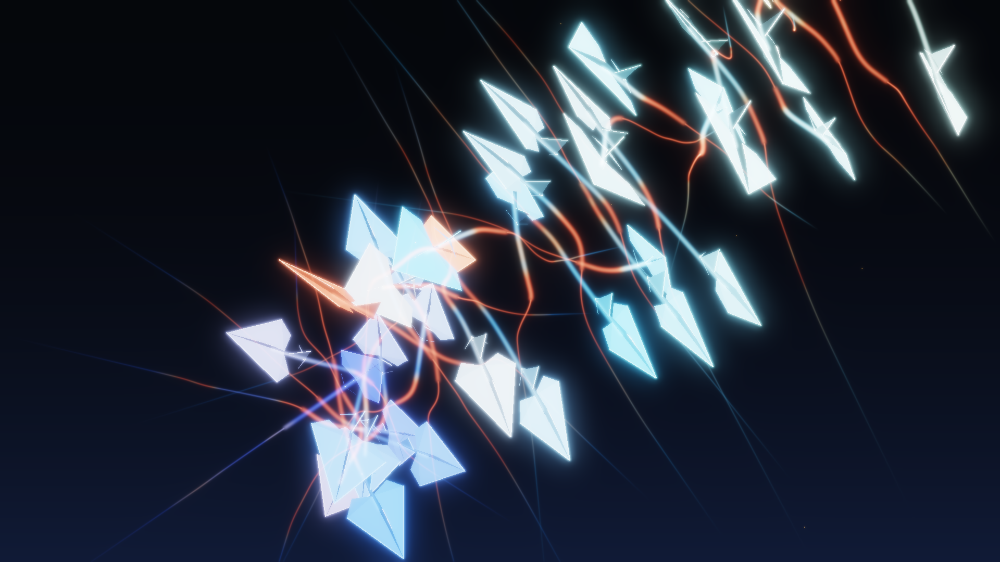

# Decentralised fixed-wing swarm autonomy

Thirty-six fixed-wing aircraft, each with its own 3-DOF flight dynamics, its own
global route, and no knowledge of anyone else's plan, flying an antipodal
exchange in which **every nominal trajectory passes through the same point** —
and keeping 60 m of separation anyway.



*The conflict-resolution burst at t = 94 s in the 36-vehicle stress test.
Cool aircraft are cruising; the ones that glow warm are the ones actively
manoeuvring, and the orange ribbons are their flight trails through the
avoidance. Colour is `0.80·|φ|/20° + 0.45·|v_safe − v_pref|/3`, i.e. bank angle
and collision-avoidance deflection — both simulated quantities. Rendered
entirely from logged simulation output; see [Visuals](#visuals).*

---

## Contents

- [What this is](#what-this-is)
- [Vehicle model](#vehicle-model)
- [Wind and turbulence](#wind-and-turbulence)
- [Global path planning](#global-path-planning)
- [Guidance](#guidance)
- [Collision avoidance](#collision-avoidance)
- [Numerical method and performance](#numerical-method-and-performance)
- [Scenarios](#scenarios)
- [Validation](#validation)
- [Results](#results)
- [Visuals](#visuals)
- [Limitations](#limitations)
- [Reproducing](#reproducing)
- [Layout](#layout)

---

## What this is

A simulation of a decentralised fixed-wing UAS swarm, built to be *checkable*
rather than merely plausible. Every vehicle runs the same five-stage stack, and
every stage is something you can point at in the literature:

```
  tangent visibility graph + A*        global route around no-fly zones
              |
              v
  L1 nonlinear guidance (Park 2004)    route -> preferred ground velocity
              |
              v
  3-D ORCA (soft) + CBF (hard)         preferred -> safe velocity, using only
              |                        locally sensed neighbours
              v
  kinematic projection                 -> a velocity the airframe can reach
              |
              v
  coordinated-turn autopilot           -> (V_cmd, phi_cmd, gamma_cmd)
              |
              v
  RK4 3-DOF fixed-wing model           -> flown state
```

There is no central allocator, no negotiation protocol and no shared plan. Each
vehicle sees the positions and ground velocities of neighbours inside a 700 m
sensing sphere (the 10 nearest), and decides alone.

The whole thing is deterministic: the same seed gives bit-identical states, and
that is asserted as a validation check against a stored reference signature.

---

## Vehicle model

A 3-DOF coordinated-turn model — a "Dubins airplane with dynamics". State per
vehicle in an East-North-Up world frame:

| symbol | meaning | |
|---|---|---|
| `x, y, z` | position (East, North, Up) | m |
| `V` | true airspeed | m/s |
| `psi` | air-relative heading (azimuth from East toward North) | rad |
| `gamma` | flight-path angle, positive climbing | rad |
| `phi` | bank angle, positive right | rad |

```
x_dot     = V cos(gamma) cos(psi) + W_x
y_dot     = V cos(gamma) sin(psi) + W_y
z_dot     = V sin(gamma)          + W_z
V_dot     = sat( (V_cmd - V)/tau_V,             +/- a_max )
psi_dot   = -g tan(phi) / V                        <-- coordinated turn
gamma_dot = sat( (gamma_cmd - gamma)/tau_gamma, +/- gamma_dot_max )
phi_dot   = sat( (phi_cmd - phi)/tau_phi,       +/- p_max )
```

Parameters are representative of a ~15 kg Group-2 fixed-wing UAS:

| quantity | value |
|---|---|
| airspeed envelope `V_min … V_nom … V_max` | 18 / 25 / 34 m/s |
| longitudinal acceleration limit | 2.0 m/s² |
| bank limit (geometric) | 45° |
| load-factor limit `n = 1/cos φ` | 1.6 → **effective bank limit 51.3° → 45°** |
| roll-rate limit | 60 °/s |
| flight-path-angle limit | ±12° |
| flight-path-angle rate limit | 8 °/s |
| lags `tau_V / tau_phi / tau_gamma` | 2.5 / 0.35 / 1.2 s |
| minimum turn radius at cruise | 63.7 m |

**Assumptions.** Thrust, drag and mass are not modelled explicitly — the
airspeed channel is a rate-limited first-order lag, which is how a closed
autothrottle behaves over the bandwidth of interest. Turns are perfectly
coordinated (zero sideslip), so the only lateral acceleration available is
`g tan(phi)`. The load-factor limit is enforced through the bank limit, exact
for a level turn and slightly conservative in a climb. Wind enters kinematically
only. Integration is fixed-step RK4 with zero-order-hold commands, which is what
a digital autopilot actually does.

---

## Wind and turbulence

Steady uniform wind plus **MIL-F-8785C Dryden** turbulence, one independent
realisation per vehicle. The one-sided spatial spectra used here are

```
Phi_u(Om) = sigma_u^2 (2 L_u/pi) / (1 + (L_u Om)^2)
Phi_w(Om) = sigma_w^2 (L_w/pi) (1 + 3 (L_w Om)^2) / (1 + (L_w Om)^2)^2
```

normalised so that `integral_0^inf Phi dOm = sigma^2`, with the temporal
spectrum following from Taylor's frozen-turbulence hypothesis,
`G(omega) = Phi(omega/V)/V`.

Realisations come from the shaping filters

```
H_u(s) = k_u / (1 + tau_u s)
H_w(s) = k_w (1 + sqrt(3) tau_w s) / (1 + tau_w s)^2 ,   tau = L/V
```

with three implementation choices worth flagging:

1. **The gain is derived, not quoted.** Textbook Dryden gains differ by factors
   of 2 depending on the one-sided/two-sided PSD convention. Here `k` is fixed
   by solving the continuous Lyapunov equation `A P + P A^T + B B^T = 0` and
   scaling `C` so the stationary output variance is exactly `sigma^2`. The
   filter fixes the *shape*, the Lyapunov scaling fixes the *area*, so the
   realised spectrum equals the analytic one by construction — and that is then
   checked numerically anyway.
2. **Sampling is exact, not Euler.** States are propagated with the van Loan
   discretisation, `A_d = expm(A dt)` and
   `Q_d = int_0^dt expm(As) B B^T expm(A^T s) ds`.
3. **Initialisation is stationary**, drawn from `P`, so there is no warm-up
   transient.

Filter time constants are frozen at nominal cruise airspeed, which keeps the
process LTI and therefore exactly testable. Gusts are rotated from wind axes
(along-track / cross-track / vertical) into ENU by the vehicle's heading.

---

## Global path planning

Obstacles are vertical no-fly **cylinders**. For disc obstacles the shortest
obstacle-free path is a sequence of tangent segments joined by boundary arcs, so
the candidate set is finite and small — a **tangent visibility graph** with A*
rather than a grid search:

* discs are inflated by a clearance (vehicle radius + separation buffer + a turn
  allowance);
* nodes are the start, the goal, and every tangent point (point-to-circle
  tangents and circle-to-circle internal/external bitangents);
* straight edges are admitted by an exact point-to-segment/disc test, vectorised
  over all node pairs and all discs at once;
* arc edges hug the inflated boundary and are rejected if sampled points fall
  inside another disc;
* the A* heuristic is Euclidean distance, admissible because every edge is at
  least as long as the straight line between its endpoints.

Densified arc vertices are placed on a slightly larger radius, `r/cos(Δ/2m)`, so
that the *chords* between them stay outside the inflated disc rather than
cutting the corner by the chord sagitta.

If the search fails the planner falls back to a direct line and flags `ok=False`
so the caller can report it rather than silently pretending the route is clean.

Planning is horizontal; the cylinders span the whole operating altitude band, so
climbing over them is not an option.

---

## Guidance

**L1 nonlinear guidance** (Park, Deyst & How, AIAA GNC 2004). Take the point on
the path at Euclidean distance `L1` ahead, let `eta` be the angle between the
ground-velocity vector and the vector to it, and command

```
a_s = 2 V_g^2 sin(eta) / L1        equivalently   psi_dot = (2 V_g / L1) sin(eta)
```

On a straight path and for small `eta` this linearises to a second-order
cross-track response with `omega_n = 2 V_g / L1` and `zeta = 1/sqrt(2)` — well
damped, with the gain adapting to airspeed automatically. `L1` is scheduled as
`clip(12 · V_g, 140, 420)` m, i.e. 300 m at cruise.

The L1 reference point is computed *exactly*: on a straight segment the
along-path offset from the foot of the perpendicular is `sqrt(L1² − xte²)`, and
on a circular path it is the closed-form intersection of the L1 circle with the
reference circle. That matters — a "carrot at arclength s + L1" implementation
leaves a standing curvature offset on an arc, and this one does not (see
[Validation](#validation) 2).

Altitude is a proportional climb-rate command folded into the preferred
velocity's vertical component; airspeed defaults to cruise unless the avoidance
layer asks otherwise.

**Heading-loop bandwidth.** While avoidance is inactive the heading rate is the
L1 law itself. When the avoidance layer deflects the command by more than
0.25 m/s the loop switches to a higher-bandwidth tracker (effective
`L1 = 2 V_g / 1.2`), because ORCA's half-space guarantee assumes the commanded
velocity is achieved promptly, not over a 12-second path-following time
constant. Validation 2 exercises the pure-L1 branch.

---

## Collision avoidance

Three layers, all assembled into one small QP per vehicle per control step.

### Layer 1 — 3-D ORCA (soft)

For a pair with relative position `x`, relative velocity `v` and combined radius
`r`, the velocity obstacle over horizon `tau` is a truncated cone; `u` is the
smallest change to `v` that escapes it, and the vehicle gets the half-space

```
(v_new - (v_A + f u)) . n >= 0 ,     n = u/|u|
```

with `f = 1/2` for a cooperative pair. Because `u_A = -u_B` exactly, two
cooperative vehicles each taking half undo the whole conflict without
communicating. A non-cooperative neighbour gets `f = 1`, i.e. the cooperative
vehicle takes the entire burden.

Two things here are not textbook and both were needed to make it work for
aircraft:

**The head-on degeneracy.** When the relative velocity lies on the cone axis —
exactly what happens in an antipodal swap — `ww = v − t·x` vanishes and the
usual normal `ww/|ww|` is undefined. The naive fixes land *inside* the obstacle.
Writing the escaped velocity as `v_new = t (x + r w)` for a unit `w`, it sits on
the true boundary `|x × v_new| / |v_new| = r` exactly when

```
cos(beta) = -r/|x| ,     beta = angle(x, w)
```

so the normal is built as `w = cos(beta) x_hat + sin(beta) e` with `e` the unit
horizontal vector to the **right** of the line of sight — the rules-of-the-air
head-on convention. Because A sees `x` and B sees `−x` (so `e` flips too), `w`
is exactly antisymmetric and reciprocity survives. Validation 3 confirms the
reciprocal split now lands on the obstacle boundary to 1 part in 10¹⁵.

**The recovery horizon.** RVO2 uses the control interval when two agents already
overlap, which for a 0.1 s tick demands `r/dt` ≈ several hundred m/s and makes
the constraint set trivially infeasible for an aircraft. A physically reachable
recovery horizon (2.5 s) is used instead.

### Layer 2 — control barrier function (hard)

For every sensed neighbour,

```
n_ij . (v_i - v_j) >= -k(h_ij) ,    h_ij = |p_ij| - (R_min + margin)
```

with the barrier profile the **tighter of** a linear class-K function `alpha·h`
and a braking bound `sqrt(2 a_cbf h)`. The braking form is the right one for a
vehicle that cannot stop: it caps closing speed at exactly what can be bled off
over the remaining distance with the available lateral acceleration, so the
vehicle starts reacting at range instead of late and hard.

### Layer 3 — no-fly zones (hard)

The same barrier row with a purely horizontal normal, so a vehicle pushed off
its route by traffic still cannot be pushed into a no-fly zone.

### Assembly

```
min |W(v - v_pref)|^2 + sum_k rho_k s_k^2     s.t.  A v >= b - s ,  s >= 0
```

with the barrier rows **hard** (`rho = inf`) and the ORCA rows **soft**, their
stiffness scaled by how close the neighbour is. This matters more than it
sounds: in a dense swarm the intersection of twenty ORCA half-spaces is
frequently empty, and the usual remedy — discard them all and fall back to a
weaker rule — throws away the easy constraints along with the impossible ones.
With quadratic slacks the solver degrades gracefully instead, keeping the urgent
half-spaces tight and giving ground on the distant ones. Only if the *hard* rows
are jointly infeasible does it fall back to a max-margin velocity over a fixed
96-direction candidate fan, and that event is counted and reported.

The QP is solved by Hildreth dual coordinate ascent (no factorisation, ~30 rows,
tens of millions of inner iterations per sweep of scenarios). Its answers are
cross-checked against `scipy.optimize` SLSQP in both the test suite and
validation 3.

The vertical axis carries weight 0.75 in the objective, making altitude changes
slightly cheaper than horizontal ones, which is appropriate given that the
vertical channel is rate-limited by `gamma_max`.

### Kinematic projection

The QP works on *ground* velocity. Both its input and its output are projected
onto the set of velocities the airframe can reach within a 2 s manoeuvre horizon
— heading change at most `g tan(phi_max)/V · T`, flight-path angle within
`gamma_dot_max·T` and `±gamma_max`, airspeed within `a_max·T` and
`[V_min, V_max]` — so the safety layer never reasons about, or commands, a
velocity the aircraft cannot fly. The horizon is a manoeuvre time scale, not a
control tick: over 0.1 s the reachable set is a pinhole, and ORCA reasons over
10 s.

---

## Numerical method and performance

* **Integrator**: fixed-step RK4, `dt = 0.05 s`, commands zero-order held.
  Measured convergence order 4.00 (see validation 1).
* **Rates**: dynamics 20 Hz, guidance + avoidance 10 Hz, logging 10 Hz
  (20 Hz for the hero run).
* **Vectorisation**: the dynamics and all metrics are vectorised over vehicles.
* **Compiled kernel**: the avoidance inner loop (neighbour selection, ORCA
  half-spaces, barrier rows, the QP) is a numba kernel. The readable numpy/Python
  reference implementation is kept in `avoidance.py` / `qp.py` and
  `tests/test_kernel_equivalence.py` asserts the two agree to **1e-9** on
  randomised swarm states, including the dense infeasible-fallback branch. The
  kernel is an optimisation, not a second algorithm — it took the 36-vehicle
  stress test from ~34 s to ~7 s.

---

## Scenarios

| scenario | what it is |
|---|---|
| `transit` | 32 vehicles crossing a 6 km corridor through seven no-fly cylinders, goal ordering reversed so routes fan across each other. Light steady crosswind. |
| `swap` | **High-density stress test.** 36 vehicles on a 2.1 km ring, each assigned the antipodal goal, so every nominal trajectory passes through one common point. No obstacles — the conflict is the point. |
| `gust` | `transit` re-flown in 8.4 m/s steady wind plus Dryden turbulence at 2.6× nominal (σ_w = 2.6 m/s). |
| `failure` | `swap` with vehicle 18 losing control authority at t = 40 s: it locks 15° of bank and stops cooperating, spiralling through the swarm while the rest must deconflict around an agent that does not reciprocate. |
| `hero` | `swap` with an undecimated state log, used for the visuals — so the hero image is a picture of the run the safety invariant is asserted on. |

Plus a **robustness sweep**: 4 turbulence levels × 5 seeds = 20 runs of a
28-vehicle transit.

---

## Validation

Five validation scripts, each with numeric pass/fail thresholds, writing JSON to
`validation/`. `make all` runs them and fails the build if any check fails.

| # | what is checked | threshold | measured | |
|---|---|---|---|---|
| 1 | steady turn radius vs `R = V²/(g tan φ)`, 25 (V, φ) cases | rel. err < 1e-6 | **4.5e-13** | PASS |
| 1 | envelope: V, bank, γ, load factor over a 60 s saturating run | inside limits | V ∈ [18.00, 34.00], \|φ\| ≤ 45.00°, \|γ\| ≤ 12.00°, n ≤ 1.414 | PASS |
| 1 | realised rates: roll, γ̇, V̇ | ≤ limit × 1.02 | 60.00 °/s, 8.00 °/s, 2.000 m/s² | PASS |
| 1 | RK4 convergence order | slope ∈ [3.7, 4.3] | **4.035** | PASS |
| 2 | L1 capture, 12 releases (±60/200/400 m, straight + R = 600 m circle) | all settle | worst settling **1010 m** straight, **1075 m** circular | PASS |
| 2 | steady-state cross-track error, straight | < 0.01 m | **5.3e-9 m** | PASS |
| 2 | steady-state cross-track error, circular | < 0.05 m | **1.9e-8 m** | PASS |
| 3 | stress test: min pairwise separation, all pairs, all times | ≥ R_min = 60 m | **69.0 m** (margin +9.0 m) | PASS |
| 3 | stress test: collisions (< 15 m) | 0 | **0** | PASS |
| 3 | stress test: goals reached | 36/36 | **36/36** by 172.0 s | PASS |
| 3 | stress test: flight envelope respected | inside limits | n ≤ 1.4142, V ∈ [18.11, 27.04] | PASS |
| 3 | ORCA reciprocity `u_A = −u_B`, 1500 random pairs | < 1e-9 m/s | **0.0** (exact) | PASS |
| 3 | reciprocal half-split resolves every conflict | 55/55 | **55/55** | PASS |
| 3 | escaped relative velocity lands on the obstacle boundary | miss/r ≥ 1 − 1e-4 | **0.9999999999999996** | PASS |
| 3 | Hildreth QP vs scipy SLSQP, 115 random problems | < 1e-6 | **2.0e-11** (objective 5.4e-10) | PASS |
| 4 | same-process reruns bit-identical | exact | **exact** | PASS |
| 4 | fixed-seed trajectory signature vs stored reference | ≤ 1e-9 | **0.0** | PASS |
| 5 | Dryden realised RMS vs σ, u / v / w | within 3 % | **1.81 % / 0.37 % / 0.13 %** | PASS |
| 5 | Dryden median PSD ratio over 0.03–30 rad/s | within 8 % of 1 | **1.011 / 1.010 / 1.007** | PASS |
| 5 | Dryden log₁₀ PSD-ratio RMS, 24 log bins | < 0.05 decades | **0.040 / 0.038 / 0.020** | PASS |

All 33 checks pass. Raw outputs, including every per-case number, are the JSON
files in `validation/`.

**On the separation invariant and sampling.** The minimum separation is computed
on the 10 Hz logged samples. The worst closing speed in the stress test bounds
how much the true continuous-time minimum can sit below the sampled one by
5.4 m, so the invariant holds with a guaranteed margin of at least
69.0 − 5.4 = **63.6 m** — still above the 60 m requirement. That bound is
reported as `sampling_gap_m` in every scenario's metrics.

**On the regression reference.** `validation/regression_reference.npz` is
created on the first run and is a hard check thereafter; delete it to
re-baseline deliberately. The numbers above come from a run where it already
existed, i.e. the comparison is real.

---

## Results

### Per scenario

Every scenario: **zero separation violations, zero collisions, zero no-fly-zone
incursions**, and the flight envelope respected throughout (peak load factor
1.414 against a 1.6 limit; airspeed, bank and flight-path angle all inside
limits).

| scenario | vehicles | horizon | min separation | margin | goals reached | last arrival | path efficiency (mean / max) | control effort | hard-infeasible fallbacks |
|---|---|---|---|---|---|---|---|---|---|
| `transit` | 32 | 390 s | 68.4 m | +8.4 m | 32/32 | 314.6 s | 1.011 / 1.024 | 1.95 rad·s | 0 |
| `swap` | 36 | 290 s | **69.0 m** (t = 85.2 s) | +9.0 m | 36/36 | 172.0 s | **1.006** / 1.026 | 3.63 rad·s | 138 |
| `gust` | 32 | 390 s | 65.7 m | +5.7 m | 32/32 | 328.7 s | 1.020 / 1.035 | 17.45 rad·s | 4 |
| `failure` | 36 | 290 s | 64.9 m (t = 94.6 s) | +4.9 m | 35/36 | — | 1.007 / 1.029 | 5.57 rad·s | 98 |

In `failure` the one vehicle that does not reach its goal *is* the failed one —
it has no control authority from t = 40 s. The other 35 all complete. The
closest any vehicle comes to the non-cooperative aircraft is **94.8 m**, well
clear: because a rogue neighbour is given the full avoidance share instead of
half, the cooperative vehicles give it a wide berth. The 64.9 m minimum is
between two *cooperative* vehicles (11 and 16, at t = 94.6 s) working around the
disruption it causes — which is the cost of one uncooperative agent, paid by
everyone else.

**The headline number.** In the stress test every one of 36 nominal routes runs
through a single point. The swarm holds 69.0 m of separation against a 60 m
requirement, loses nobody, and pays **0.6 % in path length** to do it. The
deconfliction is not free — peak commanded deflection reaches 59.0 m/s, airspeed
is modulated from 27.0 down to 18.1 m/s, and vehicles deviate up to 164 m from
their direct line (61 m on average) — but because the braking barrier makes them
react at range rather than late, the corrections are early and almost entirely
recovered by the time they reach their goals.

### Robustness sweep

20 runs: 4 turbulence levels × 5 seeds, 28-vehicle transit, 400 s each.

| σ_w | mean wind | worst min separation | median min separation | violation samples | collisions | goals reached | path efficiency |
|---|---|---|---|---|---|---|---|
| 0.0 m/s | 0.0 m/s | 60.9 m | 63.5 m | 0 | 0 | 100 % | 1.011 |
| 1.0 m/s | 6.9 m/s | 58.8 m | 62.6 m | 3 | 0 | 100 % | 1.012 |
| 2.0 m/s | 10.4 m/s | 63.5 m | 66.8 m | 0 | 0 | 100 % | 1.017 |
| 3.0 m/s | 10.4 m/s | **44.6 m** | 57.3 m | 59 | 0 | 100 % | 1.025 |

Across all 20 runs: zero collisions, zero no-fly-zone incursions, 100 % goal
completion, mean path efficiency 1.016. The separation requirement does
**degrade** at the top of the turbulence range — see
[Limitations](#limitations). Path efficiency rises monotonically with
turbulence, which is the expected signature of a guidance loop working harder
against the disturbance.

### Cost

`make all` on 4 cores, from a clean tree: **8.8–11.0 min** wall over three
measured runs — scenarios ~35 s (four in parallel), robustness sweep 20 runs
~2 min, validation ~2 min, figures ~20 s, hero render + H.264 encode 5–6 min.
A fourth run measured 18.5 min while another job was competing for the same four
cores, so treat ~10 min as the free-machine figure and ~19 min as the contended
one. `pytest`: **97 test cases from 78 test functions, 21 s**.

---

## Visuals

`media/hero.png` (1920×1080) and `media/hero.mp4` (1920×1080, 30 fps, 22.0 s,
11.4 MB, CRF 16) are generated by `make_hero.py` entirely from the logged `swap`
run — 660 frames covering simulation time 60–126 s at 3× real time, so the shot
runs from the approach, through the conflict burst at t ≈ 80 s, to the swarm
re-forming on the far side. There is no matplotlib anywhere in that path.

The renderer is a small custom one:

1. a real pinhole perspective camera in numpy, aimed at the live swarm
   centroid and **rolled 55°**. The roll matters: at the conflict the swarm is a
   tall thin column (a 1.1 km altitude band, a few hundred metres of horizontal
   spread), so an upright camera puts it down the middle of the frame with dead
   space either side. Canting it lays that column corner to corner instead;
2. flight trails additively splatted into a float32 HDR buffer with bilinear
   deposition (`np.bincount` accumulation), **tapered** — the fresh third of the
   history is splatted with high energy and blurred wide, the older history with
   low energy and blurred narrow, so a stroke thins and dims with age;
3. each aircraft is a real 3-D mesh — swept wings, fuselage spine and keel,
   tailplane, fin, canopy — rotated by the vehicle's actual `(psi, gamma, phi)`,
   depth-sorted facet by facet and rasterised with PIL polygon fill. Shading is
   **two-sided** against a fixed key light: a facet whose outward normal faces
   the light is a lit upper surface, one facing away is an underside and is
   rendered about five times darker. That asymmetry, plus the fact that the
   facet normals genuinely differ, is what makes bank angle read — as an
   aircraft rolls, its wings swing through the light while the fin does the
   opposite, and its underside comes into view;
4. one small very bright engine point per vehicle, which after bloom is what
   makes each aircraft separate from the dark background;
5. atmospheric extinction (`exp(-depth/4200 m)`) and perspective size falloff for
   depth cueing;
6. multi-scale bloom (σ = 2, 8, 28 px) and an ACES-like filmic tone map.

Colour comes from two simulated quantities: cruise altitude sets the base hue on
a cool indigo→cyan ramp, and manoeuvre activity (bank angle plus
collision-avoidance deflection) blends it toward amber/red — so the aircraft that
are working for their separation are the ones that glow hot, and the warm
ribbons in the image are literally the avoidance manoeuvres.

Six supporting figures are in `figures/`:

| figure | what |
|---|---|
| `fig1_separation.png` | minimum pairwise separation vs time for all four scenarios against `R_min` and `R_collision` |
| `fig2_topdown.png` | top-down transit trajectories with no-fly zones and planned routes |
| `fig3_tracking.png` | L1 cross-track capture, straight and circular |
| `fig4_dryden.png` | realised vs analytic Dryden PSD, all three components |
| `fig5_sweep.png` | safety, efficiency and completion across the wind × seed sweep |
| `fig6_failure.png` | the failure-case timeline |

---

## Limitations

These are the things I would raise first in a review of this work.

**1. The separation invariant degrades under severe turbulence.** At σ_w = 3 m/s
(3× nominal, on top of 10.4 m/s of steady wind) the worst of five seeds dropped
to **44.6 m** against the 60 m requirement — 59 sample-violations across those
five runs. There were still zero collisions and 100 % goal completion, but the
invariant asserted in validation 3 is asserted on the *nominal-wind* stress
test, not on that corner. The honest statement is that the design holds 60 m up
to about 2× nominal turbulence and degrades gracefully beyond it.

**2. The CBF guarantee is for the kinematic model, not the airframe.** Forward
invariance of `h ≥ 0` is a theorem for a single integrator that can realise its
commanded velocity instantly. A fixed-wing aircraft reaches it through roll and
airspeed lags, so the guarantee is approximate in exactly the regime that
matters. That is why this README reports *measured* separation everywhere rather
than claiming a proof, and why the braking-distance barrier profile is used —
it is a mitigation, not a fix.

**3. The safety metric is sampled, not continuous.** Minimum separation comes
from 10 Hz logs. The sampling-gap bound (5.4 m for the stress test) is reported
so the claim can be discounted properly, but there is no continuous-time
certificate.

**4. No sensing model at all.** Neighbour positions and velocities are exact
inside the sensing sphere: no noise, no latency, no dropout, no track
association, no false tracks. Latency in particular would bite — ORCA's
half-space is built from the neighbour's *current* velocity, and even 200 ms of
staleness would eat a large part of the 9 m margin. This is the single biggest
gap between this simulation and a flyable system.

**5. Turbulence is spatially uncorrelated between vehicles.** Each aircraft
draws an independent Dryden realisation. Real neighbours flying 100 m apart see
strongly correlated gusts, which would *reduce* relative excursions — so this
choice is conservative for separation, but it is not physical.

**6. Gusts enter kinematically only.** An additive wind vector; no gust-induced
roll moment from a gradient across the span, no change in the aerodynamic state.

**7. One failure mode.** The failure case models a single vehicle that locks a
bank angle and stops cooperating. No sensor failures, no partial degradation, no
comms loss, no two simultaneous failures, no adversarial behaviour.

**8. Planning is horizontal and obstacles are discs.** No polygonal no-fly
zones, no terrain, no altitude-dependent zone geometry. The tangent-graph
argument is specific to circular obstacles; a polygonal workspace needs a
different (standard, but different) visibility graph.

**9. Vertical separation does a lot of the work.** In the stress test the
minimum *horizontal* separation reaches 0.23 m — two aircraft pass directly over
one another — but with 150 m of vertical spacing at that instant, so the 3-D
separation is never at risk there. At the genuinely tightest encounter (68.99 m)
the split is 51.5 m horizontal and 45.9 m vertical, i.e. both axes contribute.
Passing over and under is normal aviation practice, but it does mean the result
leans on the altitude assignment being available, and a swarm confined to a
tighter altitude band would be a harder problem.

**10. The head-on tie-break is a design choice, not an optimum.** It resolves
the degeneracy exactly and preserves reciprocity, but the escape it produces is
not the minimum-norm one, so near-head-on encounters get a slightly larger
manoeuvre than strictly necessary.

**11. Dryden filter time constants are frozen at nominal airspeed.** This keeps
the process LTI (and therefore exactly testable against the analytic spectrum).
Airspeed excursions in these scenarios are a few percent, so the induced scale
error is small, but it is an approximation.

**12. The QP is infeasible more often than is comfortable.** In the stress test
the hard rows alone were jointly infeasible on 138 of ~104,000 vehicle-steps
(0.13 %), each time falling back to a max-margin velocity from a fixed
96-direction fan. That fallback has no guarantee attached; it is a "least
unsafe" heuristic, and it is counted and reported rather than hidden.

**13. Determinism is pinned to this stack.** The stored regression signature was
generated with the exact versions in `requirements.txt`. A different numba or
BLAS build could shift the last bits and trip the 1e-9 tolerance — that would
be a false alarm, not a regression.

**14. Not validated against flight data.** Every check here is internal
consistency: analytic solutions, convergence orders, spectra, invariants and
cross-solver agreement. Nothing has been compared with a real aircraft.

---

## Reproducing

```bash
pip install -r requirements.txt       # numpy/scipy/matplotlib/numba/pillow/imageio-ffmpeg
make all                              # scenarios -> sweep -> validation -> figures -> hero
make test                             # pytest
make quick                            # short version, still image only
make validate                         # validation scripts only
make figures                          # rebuild figures/ from existing results/
make hero                             # rebuild media/hero.png and media/hero.mp4
```

`run_all.py` is the single entry point and is directly runnable. Everything is
seeded; `results/summary.json` holds the machine-readable numbers.

---

## Layout

```
02-swarm-autonomy/
  README.md            this file
  HANDOFF.md           status, validation numbers, headline result, limitations
  requirements.txt     == pins for the exact stack used
  Makefile             all / test / quick / validate / figures / hero
  run_all.py           full reproduction
  pyproject.toml       pytest + packaging config
  make_figures.py      the six supporting figures
  make_hero.py         the hero renderer (no matplotlib)
  src/swarmsim/
    config.py          parameter dataclasses, no-fly-zone primitive
    dynamics.py        3-DOF coordinated-turn model + RK4
    wind.py            steady wind + Dryden turbulence
    planner.py         tangent visibility graph + A*
    guidance.py        L1 nonlinear guidance, altitude/airspeed loops
    qp.py              Hildreth QP with hard and soft rows
    avoidance.py       3-D ORCA + CBF safety filter (reference implementation)
    _kernels.py        numba kernel for the avoidance hot loop
    sim.py             simulation engine
    scenarios.py       scenario definitions
    metrics.py         scenario metrics
    render.py          camera, glyph mesh, splatting, tone map
  tests/               pytest suite
  validation/          validation scripts + their JSON outputs + reference
  figures/             six supporting PNGs
  media/               hero.png, hero.mp4
  results/             per-scenario pickles, sweep.json, summary.json
```
