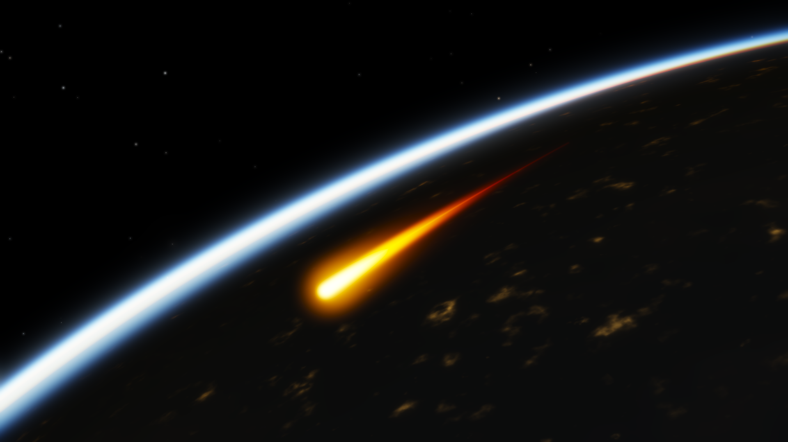

# Hypersonic Atmospheric Reentry Simulator

A physically grounded 3-DOF entry simulator for a blunt capsule returning from orbit:
the 1976 U.S. Standard Atmosphere implemented from its defining layer table,
modified-Newtonian aerodynamics obtained by integrating the pressure field over a real
sphere-cone geometry, Sutton–Graves stagnation-point heating, inverse-square gravity over
a spherical Earth, and DOP853 integration with terminal events — validated against four
closed-form benchmarks with numeric pass/fail thresholds.

The hero visual is rendered from the simulation output alone: the trail's **colour is the
Planck-locus colour of the radiative-equilibrium wall temperature** computed from the
simulated Sutton–Graves heat flux, and the atmospheric limb glow is a scattering integral
taken along every view ray through the *same USSA76 density profile* the vehicle flew
through.



*Peak heating: t = 87.2 s after the 120 km entry interface, 55.2 km altitude, 6.73 km/s,
q̇ = 155.1 W/cm², wall at 2382 K. Every pixel is derived from `results/traj_ballistic.npz`.*

---

## 1. Physical model

### 1.1 Gravity and geometry

Central inverse-square gravity, `mu = 3.986004418e14 m^3 s^-2` (WGS-84/EGM-96), over a
**spherical** Earth of radius `R = 6371.0 km` — the WGS-84 mean radius `R1 = 6371.0088 km`
rounded to 6371.0 km and used consistently, so that altitude is exactly `h = r - R`.
J2 and higher harmonics are **not** modelled.

**Earth rotation is implemented but switched off for every reported result.** The rotating
terms (Coriolis and centrifugal) are present in `EntryModel.rhs` and are exercised by
Validation 1: with `omega = OMEGA_EARTH` and no atmosphere, the trajectory is compared
against a completely independent inertial Cartesian two-body propagation and agrees to
**4.1e-5 m over 3000 s**. Turning rotation on is a one-argument change
(`simulate(..., omega=OMEGA_EARTH)`).

### 1.2 Atmosphere — USSA76

`src/reentry/atmosphere.py`.

* **0 – 86 km (geometric).** The standard's seven geopotential layers. Temperature is
  piecewise linear in geopotential altitude `H = r0 Z/(r0+Z)` with `r0 = 6356766 m`; the
  barometric relation is integrated analytically inside each layer. **Only** the sea-level
  state (288.15 K, 101325 Pa) and the lapse-rate table are hard-coded — every layer base
  pressure is *derived* by chaining upward. The published USSA76 base pressures are
  therefore a genuine external check (Validation 3).
* **86 – 1000 km.** The USSA76 *kinetic temperature* profile is used exactly (186.8673 K
  isothermal to 91 km; the elliptical segment `T = 263.1905 - 76.3232 sqrt(1-u^2)`,
  `u = (Z-91)/19.9429` km, to 110 km; linear 12 K/km to 120 km; the exospheric exponential
  approach to `T_inf = 1000 K` above). Pressure comes from integrating
  `d ln p/dZ = -g(Z) M/(R* T(Z))` with `g(Z) = g0 (r0/(r0+Z))^2` on a 20 m grid and a cubic
  spline in `ln p`.
  **Documented simplification:** the mean molecular weight is held at its sea-level value.
  The real USSA76 upper atmosphere solves species-diffusion equations for N2/O/O2/Ar/He/H,
  so `M` falls above the turbopause; holding `M = M0` makes the scale height slightly too
  small. See Limitations.
* Speed of sound `a = sqrt(gamma R T)` with `gamma = 1.4`, `R = R*/M0 = 287.0528 J/(kg K)`.
* A 10 m lookup table accelerates the ODE right-hand side; its interpolation error against
  the exact closed form is **measured**, not assumed: max 1.13e-6 relative in density over
  0–300 km (Validation 3).

### 1.3 Aerodynamics — modified Newtonian on a sphere-cone

`src/reentry/aerodynamics.py`.

The vehicle is a **70° sphere-cone aeroshell**: spherical nose `R_n = 0.65 m` tangent to a
70° half-angle cone ending at base radius `R_b = 1.30 m`; reference area
`A = pi R_b^2 = 5.309 m^2`; mass 1200 kg. Tangency is at polar angle
`phi_t = 90° - theta_c = 20°`.

Local pressure coefficient `Cp = Cp_max sin^2(delta)` with `sin(delta) = -n̂ · V̂_inf`;
panels in the Newtonian shadow (`n̂ · V̂_inf > 0`) contribute nothing. The forebody is
discretised into 400 × 512 panels and the force integral is evaluated numerically, so the
model works at arbitrary angle of attack without any closed-form bookkeeping.

`Cp_max` is **not a tuned constant**. It is the actual stagnation pressure coefficient:

* `M > 1`: Rayleigh pitot relation (normal shock + isentropic compression to rest),
  → 1.83937105 as `M → ∞` for `gamma = 1.4`;
* `M ≤ 1`: isentropic stagnation coefficient, → 1 as `M → 0`, and equal to 1.275601 at
  `M = 1`, so the branches join continuously.

That is the entire source of the Mach dependence of `C_D` in this project — **no empirical
`C_D(M)` curve is fitted anywhere**. Because `Cp_max` factors out of the surface integral,
the shape integrals `C_A/Cp_max` and `C_N/Cp_max` depend only on angle of attack and are
evaluated once and cached.

The panel integrator is checked against two exact Newtonian results (unit tests):

| case | analytic `C_D` | computed | rel. error |
|---|---|---|---|
| hemisphere (+ cylinder) | `Cp_max/2` = 0.9196855 | 0.9196866 | 1.1e-6 |
| sharp 20° cone | `Cp_max sin²20°` = 0.215166 | 0.215166 | < 2e-6 |
| sharp 45° cone | 0.919686 | 0.919686 | < 2e-6 |
| sharp 70° cone | 1.624206 | 1.624206 | < 2e-6 |

Resulting vehicle coefficients at M = 25:

| configuration | `C_D` | `C_L` | `L/D` | `beta = m/(C_D A)` |
|---|---|---|---|---|
| ballistic, `alpha = 0` | 1.6263 | 0 | 0 | 139.0 kg/m² |
| lifting, `alpha = 20°` | 1.3844 | 0.4314 | **0.3116** | 163.3 kg/m² |

(Sign convention: the freestream at `+alpha` tilts toward `+z_body`, so the trimmed lifting
case uses `alpha = -20°`, which puts the Newtonian lift vector along `+z_body` — "lift up"
at zero bank. The bank angle then rotates that vector about the velocity.)

**Validity.** Newtonian impact theory is a hypersonic strong-shock approximation: good to a
few percent for blunt bodies at `M ≳ 5`, degrading through the supersonic range, and *not*
valid below `M ≈ 1.5`. It also omits skin friction and base pressure entirely, so `C_D`
here is a forebody pressure-drag coefficient.

### 1.4 Heating

`src/reentry/heating.py`.

**Primary — Sutton & Graves (1971):**

```
qdot_cw = k sqrt(rho / R_n) V^3,      k = 1.7415e-4  (SI, W/m^2)
```

**Cross-check — Detra–Kemp–Riddell form:**

```
qdot_cw = C / sqrt(R_n) (rho/rho_sl)^0.5 (V/V_co)^3.15,   C = 1.1037e8 W/m^2, V_co = 7924.8 m/s
```

> **Honesty note.** The DKR leading coefficient is quoted from memory and could **not** be
> verified against the primary reference in this offline environment. It is used only as a
> sensitivity cross-check, never as a validated reference. To separate the coefficient from
> the exponent, a third curve re-anchors the `V^3.15` exponent to Sutton–Graves at `V_co`
> (`heat_flux_exponent_sensitivity`), which involves no unverified constant at all.

Measured differences on the nominal ballistic entry:

| quantity | Sutton–Graves | DKR form | `V^3.15` re-anchored |
|---|---|---|---|
| peak heat flux | **155.1 W/cm²** | 174.2 W/cm² (+12.3 %) | 151.4 W/cm² (−2.4 %) |
| total heat load | **7513 J/cm²** | 8327 J/cm² (+10.8 %) | 7238 J/cm² (−3.7 %) |

The two effects separate cleanly. Changing *only* the velocity exponent from 3 to 3.15
(anchored at `V_co`) **lowers** the integrated load by 3.7 %, because the vehicle spends
most of the heating pulse below `V_co` = 7924.8 m/s, where a steeper exponent means less
heating. The DKR form is nonetheless 10.8 % *higher*, so its entire excess — a factor 1.15
— comes from its leading coefficient, which is the number this project could not verify.
Sutton–Graves is used for every reported number and for the hero render.

**Radiative-equilibrium wall temperature.** A thin, non-ablating, radiatively cooled TPS
surface balances incoming convection against its own re-radiation:

```
eps sigma T_w^4 = qdot      =>      T_w = (qdot / (eps sigma))^(1/4)
```

with `eps = 0.85` (a representative coated-ceramic / charred-ablator value; a documented
modelling choice) and `sigma = 5.670374419e-8 W m^-2 K^-4`. Peak `T_w` = **2382 K**
cold-wall; applying the hot-wall enthalpy correction `qdot_net = qdot (1 - h_w/h_0)`
(fixed-point, perfect-gas `c_p`) lowers it to 2319 K, a 2.6 % effect.

### 1.5 Equations of motion

State `y = [r, lon, lat, V, gamma, psi, Q, W, s]` (radius, longitude, latitude,
atmosphere-relative speed, flight-path angle, heading, integrated heat load, specific drag
work, ground-track downrange):

```
dr/dt     = V sin(gamma)
dlon/dt   = V cos(gamma) sin(psi) / (r cos(lat))
dlat/dt   = V cos(gamma) cos(psi) / r
dV/dt     = -D/m - (mu/r^2) sin(gamma)
            + omega^2 r cos(lat) [sin(gamma) cos(lat) - cos(gamma) sin(lat) cos(psi)]
dgamma/dt = (1/V) { (L/m) cos(sigma) + (V^2/r - mu/r^2) cos(gamma)
                    + 2 omega V cos(lat) sin(psi)
                    + omega^2 r cos(lat) [cos(gamma) cos(lat) + sin(gamma) sin(lat) cos(psi)] }
dpsi/dt   = (1/V) { (L/m) sin(sigma)/cos(gamma) + (V^2/r) cos(gamma) sin(psi) tan(lat)
                    - 2 omega V [tan(gamma) cos(lat) cos(psi) - sin(lat)]
                    + (omega^2 r / cos(gamma)) sin(lat) cos(lat) sin(psi) }
dQ/dt     = qdot        dW/dt = (D/m) V        ds/dt = R V cos(gamma) / r
```

with `D = q A C_D`, `L = q A C_L`, `q = ½ rho V²`. Carrying `Q`, `W` and `s` as ODE states
means they are integrated to the same order as the dynamics, and `W` makes the energy
balance a real closure test (Validation 4).

### 1.6 Numerics

* **Production integrator:** `scipy.integrate.solve_ivp` with **DOP853**, `rtol = atol = 1e-10`,
  dense output, and three terminal events — descent through 10 km (nominal), ascent through
  the entry interface (skip-out), and a velocity floor.
* **Independent integrator:** a fixed-step classical **RK4** on the same right-hand side,
  used for the convergence-order study and as a cross-check.
* Accuracy is *measured*: at `rtol = 1e-10` the peak heat flux is converged to 5.6e-10
  relative and the total heat load to 3.4e-10 (Validation 4D). Even a loose `rtol = 1e-6`
  (1172 RHS evaluations) gets the peak heat flux to 2.2e-6.

---

## 2. Validation

All four validations execute as part of `make all` **and** as part of `pytest`, write JSON +
text reports to `validation/`, and abort the pipeline on failure.
**44 / 44 numeric checks pass.** Full tables: `validation/validation_report.txt`.

### 2.1 Vacuum orbital behaviour (`val_01_orbit_energy.py`)

| check | value | threshold |
|---|---|---|
| circular orbit: `\|ΔE/E\|` drift over 3 periods | **7.6e-16** | < 1e-11 |
| circular orbit: `\|Δh/h\|` drift over 3 periods | **2.9e-16** | < 1e-11 |
| circular orbit: radius drift | **0.0 m** | < 1e-3 m |
| semi-major axis error `\|a - r0\|` | **5.6e-9 m** | < 1e-3 m |
| position closure after one Keplerian period `2π√(a³/μ)` | **1.09e-8 m** | < 1 m |
| closure / orbit circumference | **2.6e-16** | < 1e-8 |
| rotating Earth: inertial `\|ΔE/E\|` drift | **7.9e-13** | < 1e-10 |
| rotating Earth: orbit-plane normal drift | **7.0e-12** | < 1e-9 |
| rotating Earth: max `\|Δr\|` vs independent inertial Cartesian 2-body | **4.1e-5 m** | < 1e-2 m |

The last row is the strongest: the flight equations and a plain Cartesian two-body
propagator share no code, and they agree to 41 µm over 3000 s of an inclined, eccentric,
rotating-frame trajectory.

### 2.2 Allen–Eggers closed-form ballistic entry (`val_02_allen_eggers.py`)

Allen & Eggers (NACA Report 1381, 1958) give, for ballistic entry into an exponential
atmosphere at constant flight-path angle,

```
a_max      = V_e^2 |sin gamma_e| / (2 e H)            (independent of the vehicle!)
z(a_max)   = H ln( rho_0 H / (beta |sin gamma_e|) ),   beta = m/(C_D A)
```

Configuration: `rho0 = 1.225 kg/m³`, `H = 7200 m`, `C_D = 1.50`, `beta = 150.7 kg/m²`,
`V_e = 7000 m/s`, entry at 120 km. The analytic solution is *anchored* by inverting the
closed form at the simulator's initial state, removing a 3e-6 finite-entry-altitude
artefact.

**A — exact limit** (gravity off, no curvature term, `gamma` frozen: the simulator's ODE
*is* the Allen–Eggers ODE):

| quantity | simulator | analytic | rel. error |
|---|---|---|---|
| peak deceleration | 625.9102257 m/s² (63.825 g) | 625.9102273 m/s² | **−2.5e-9** |
| altitude of peak | 34.2919535 km | 34.2919513 km | **+6.2e-8** |
| speed at peak | 4245.72897 m/s | 4245.72898 m/s | **−6.8e-10** |
| max deviation of the whole `a(z)` profile / `a_max` | — | — | **5.1e-11** |

**B and C — releasing the assumptions one at a time.** B restores spherical geometry, the
`V²/r` term and a free flight-path angle but keeps gravity off, isolating the
constant-`gamma` assumption. C is the full physics.

| `gamma_e` | A–E `a_max` | B error (constant-γ only) | C error (full) | predicted gravity-work term `2ḡΔz/V_e²` |
|---|---|---|---|---|
| −10° | 22.17 g | −43.27 % | +14.64 % | +3.05 % |
| −20° | 43.66 g | −9.33 % | +6.47 % | +3.25 % |
| −30° | 63.83 g | −3.75 % | +4.90 % | +3.35 % |
| −45° | 90.26 g | −1.28 % | +4.23 % | +3.45 % |
| −60° | 110.55 g | −0.43 % | +4.03 % | +3.51 % |
| −90° | 127.65 g | **−1.6e-12 %** | +3.93 % | +3.55 % |

(The sweep also contains `gamma_e = -5°`, omitted from the table: with gravity switched
off, the centrifugal term alone pulls such a shallow trajectory straight back out of the
atmosphere, so "peak deceleration" is not a meaningful comparison there. It is in
`validation/val_02_allen_eggers.json`.)

Column B goes to *machine precision* at vertical entry, exactly as it must: at
`gamma = -90°` there is nothing for the curvature term to turn. Column C does **not** go to
zero, and that is not an error — Allen–Eggers neglects the work gravity does on the vehicle
between the entry interface and the peak-deceleration altitude. The last column is that work
estimated independently as `2 ḡ (z_0 - z_peak)/V_e²`; it accounts for the residual to within
0.8 percentage points at `gamma ≤ -45°`, which is itself an asserted check. The altitude of
peak deceleration is reproduced to better than **0.17 km** for all entries steeper than −30°.

### 2.3 USSA76 vs the published standard table (`val_03_atmosphere_table.py`)

Model values at the eight layer boundaries against the published USSA76 table (which the
model never uses):

| `H` [km′] | `T` [K] | rel. err | `p` [Pa] | rel. err | `rho` [kg/m³] | rel. err |
|---|---|---|---|---|---|---|
| 0 | 288.150 | 0 | 1.013250e5 | 0 | 1.22500e0 | 6.9e-7 |
| 11 | 216.650 | 1.3e-16 | 2.263206e4 | 1.8e-7 | 3.63918e-1 | 2.1e-5 |
| 20 | 216.650 | 1.3e-16 | 5.474889e3 | 6.0e-8 | 8.80348e-2 | 2.2e-6 |
| 32 | 228.650 | 1.2e-16 | 8.680187e2 | 1.8e-8 | 1.32250e-2 | 2.7e-8 |
| 47 | 270.650 | 0 | 1.109063e2 | 5.0e-8 | 1.42753e-3 | 2.3e-5 |
| 51 | 270.650 | 0 | 6.693887e1 | 4.7e-8 | 8.61605e-4 | 5.7e-6 |
| 71 | 214.650 | 1.3e-16 | 3.956420e0 | 1.1e-7 | 6.42110e-5 | 2.1e-7 |
| 84.852 | 186.946 | 1.5e-16 | 3.733836e-1 | 2.7e-8 | 6.95788e-6 | 1.1e-5 |

Worst case: **1.5e-16 in temperature, 1.8e-7 in pressure, 2.3e-5 in density** — the
pressure and density residuals are at the level of the published table's own 7-figure
rounding. Additionally: the hydrostatic residual `|dp/dz + rho g|/(rho g)` has median
**1.1e-9** and maximum **5.8e-7** from 0.1 m to 500 km (away from lapse-rate breakpoints,
where a centred difference loses an order); the sea-level speed of sound matches
`sqrt(gamma R T0)` exactly; pressure and density are strictly monotone over 0–1000 km;
the 86 km model seam (molecular-scale vs kinetic temperature) produces a density step of
**8.35e-5** relative.

### 2.4 Energy budget and convergence order (`val_04_energy_convergence.py`)

**Energy budget.** Lift is perpendicular to the velocity and does no work, so
`Δ(V²/2 − μ/r) + ∫(D/m)V dt` must vanish identically:

| case | `ΔE` [J/kg] | `W_drag` [J/kg] | relative closure |
|---|---|---|---|
| ballistic | −3.147223017284e7 | +3.147223017284e7 | **8.9e-15** |
| lifting | −3.147154709752e7 | +3.147154709752e7 | **9.5e-14** |

That is machine precision — the entry dissipates **31.5 MJ/kg**, and the drag work accounts
for all of it to fourteen digits.

**RK4 convergence order**, 100 s window, exponential atmosphere (so the right-hand side is
`C^∞`), error measured against DOP853 at `rtol = 1e-13`:

| steps | Δt [ms] | relative error | observed order |
|---|---|---|---|
| 125 | 800 | 7.02e-6 | — |
| 250 | 400 | 4.26e-7 | 4.043 |
| 500 | 200 | 2.62e-8 | 4.022 |
| 1000 | 100 | 1.62e-9 | 4.011 |
| 2000 | 50 | 1.01e-10 | 4.006 |
| 4000 | 25 | 6.28e-12 | **4.008** |

Clean fourth order over five refinements; refining further saturates against the reference's
own ~3e-12 accuracy.

**Integrator cross-check.** On the full USSA76 entry, adaptive DOP853 and fixed-step RK4
(Δt = 7.5 ms) agree to **4.6e-6 m** in altitude and **2.7e-7 m/s** in speed after 150 s.

---

## 3. Results

Nominal case: 1200 kg 70° sphere-cone, entry interface at 120 km, 7800 m/s,
`gamma_e = -5.5°`, non-rotating Earth, terminated at 10 km.

| quantity | ballistic (`alpha`=0) | lifting (`alpha`=20°, bank 0, `L/D`=0.31) |
|---|---|---|
| peak stagnation heat flux | **155.1 W/cm²** at 55.2 km, 6.73 km/s, t = 87.2 s | 149.2 W/cm² at 57.7 km |
| peak radiative-equilibrium wall temperature | **2382 K** | 2359 K |
| integrated heat load (Sutton–Graves) | **7513 J/cm²** | **11 274 J/cm²** |
| peak deceleration | **15.57 g** at 44.0 km | **7.85 g** at 54.3 km |
| peak dynamic pressure | 21.3 kPa | 12.0 kPa |
| peak Mach number | 28.6 | 28.6 |
| downrange | 861 km | **1533 km** |
| time of flight to 10 km | 251 s | 484 s |

**The headline trade.** Flying the same entry at a 20° trim angle of attack with the lift
vector up — `L/D` = 0.31, obtained from the Newtonian surface integral, not assumed — cuts
the peak deceleration **almost exactly in half (15.57 g → 7.85 g)** and nearly doubles the
downrange, but it does so by holding the vehicle higher for longer, and the price is a
**50 % larger integrated heat load** (7513 → 11 274 J/cm²). That is the classic entry-vehicle
dilemma in one line: lift buys you structural and crew margin and pays for it in thermal
protection mass.

**Entry corridor** (`results/corridor.json`, 90 trajectories):

* At LEO entry speed (7800 m/s, which is *sub*-circular — circular speed at 120 km is
  7836 m/s) the ballistic vehicle is captured for **every** flight-path angle from −1° to
  −12°: there is no skip-out boundary, only a long shallow limit. On the 0.25° sweep grid a
  10 g deceleration is first exceeded at `gamma_e` = **−3.25°** and at every steeper angle.
* At super-circular speed (11 000 m/s, lunar-return-like) there *is* a sharp skip-out
  boundary, located by bisection at **`gamma_e` = −5.006°**: at −5.00° the vehicle dips to
  69 km, pulls 3.3 g, and flies back out through the entry interface; at −5.01° it is
  captured. On the same 0.25° grid the first captured case exceeding 10 g is −5.75°
  (−5.5° is still below 10 g), so the usable corridor — steep enough to be captured, shallow
  enough to stay under 10 g — is **less than 0.75° wide**.

---

## 4. How the hero visual is derived from the physics

`src/reentry/render/` — `raymarch.py` (numba), `compose.py`, `hero.py`;
driver `scripts/make_hero.py`.

* **Trail geometry** — the integrated trajectory, converted to inertial Cartesian
  coordinates and resampled uniformly *in arc length* (uniform-in-time sampling would make
  the deposited brightness depend on the vehicle's speed).
* **Trail brightness** — the simulated Sutton–Graves heat flux `qdot(t)`, normalised by its
  peak, times a wake-persistence factor `exp(-Δt/55 s)`. The persistence time constant is
  the one openly invented number in the trail; the shape of the glow along the path *is*
  the heat-flux history.
* **Trail colour** — from that same heat flux:
  `T_w = (qdot/(eps sigma))^(1/4)` → Planck spectral radiance `B(lambda, T_w)` → projected
  onto the CIE 1931 2° colour-matching functions (the analytic multi-lobe Gaussian fit of
  Wyman, Sloan & Shirley, JCGT 2013) → XYZ → linear sRGB. The trail is literally the colour
  of the glowing heat shield: deep red at the ~1200 K wall the video opens on,
  orange-white at the 2382 K peak, fading back through red as the flux decays. The colour model is self-validated in `tests/test_heating_and_colour.py` (the locus
  must pass within 0.02 of the D65 white point at 6500 K and vary monotonically in
  chromaticity).
* **Limb glow** — for every pixel the renderer marches the view ray through a shell from the
  surface to 140 km and accumulates
  `sum beta_R (rho(z)/rho_sl) T_view T_sun ds`, where `rho(z)` is the **actual USSA76
  density** used by the trajectory (passed in as a log-density table) and `beta_R` are the
  standard sea-level Rayleigh coefficients (5.8, 13.5, 33.1) × 1e-6 m⁻¹. The blue arc, its
  thickness, and its reddening near the terminator all come out of that integral.
* **Trail extinction** — the column density between the camera and each trail point is
  integrated through the same profile, so the trail reddens as it descends into denser air.
* **Earth** — an exact analytic sphere with Lambert shading, a Blinn-Phong ocean glint, and
  a procedural 3-D-noise albedo/cloud/settlement-light field. The surface detail is
  *invented* (there is no Earth texture in this repository) and is documented as such.
* **Compositing** — additive bilinear splatting into a float HDR buffer, three-scale bloom
  (σ = 2, 8, 28 px), ACES-like filmic curve, per the shared rendering playbook.

`media/hero.png` is rendered at 2× supersampling (3840×2160 → 1920×1080) with 72
ray-march samples at the peak-heating instant. `media/hero.mp4` is 1920×1080, 30 fps, 18 s,
540 frames covering t = 30 s → 195 s of simulation time, and shows the onset, the peak and
the decline of heating with a slow dolly-in and roll. `media/hero_manifest.json` records the
exact camera and scene parameters.

### Figures

| file | content |
|---|---|
| `figures/fig1_entry_corridor.png` | altitude–velocity corridor (skip-out vs capture) and the corridor sweep with the bisected skip-out boundary |
| `figures/fig2_heating.png` | heat flux from all three correlations, integrated load, wall temperature |
| `figures/fig3_loads.png` | deceleration and dynamic-pressure histories, ballistic vs lifting |
| `figures/fig4_allen_eggers.png` | the Allen–Eggers error decomposition and the peak-deceleration comparison |
| `figures/fig5_atmosphere_validation.png` | USSA76 profiles with the published table points and the per-boundary errors |
| `figures/fig6_aerodynamics.png` | `Cp_max(M)`, `C_D(M)`, and `C_D/C_L/(L/D)` vs angle of attack |

---

## 5. Limitations

Stated plainly; none of these are hidden in the numbers above.

1. **3-DOF point mass.** No attitude dynamics, no trim solution, no control. The lifting
   case *prescribes* a trim angle of attack and a bank angle; a real capsule reaches trim
   through a centre-of-gravity offset and would exhibit pitch/roll dynamics and oscillation.
2. **Newtonian aerodynamics.** Good to a few percent for blunt bodies at `M ≳ 5`, degrading
   through the supersonic range, and *not valid* below `M ≈ 1.5` — yet the trajectory is
   integrated down to Mach 0.38. Skin friction and base drag are omitted entirely, so `C_D`
   is a forebody pressure-drag coefficient. The last ~20 s of each trajectory should be read
   as "the vehicle is subsonic and decelerating", not as a quantitative result.
3. **Heating correlations are engineering correlations.** Sutton–Graves is a cold-wall,
   stagnation-point, convective correlation for air. **Radiative (shock-layer) heating is
   not modelled at all** — negligible for the 7.8 km/s LEO case but *not* negligible for the
   11 km/s corridor sweep, whose heat-flux numbers are therefore lower bounds. Ablation,
   surface catalysis, and transition to turbulence are absent. The DKR cross-check
   coefficient could not be verified offline (§1.4).
4. **Atmosphere above 86 km.** The kinetic-temperature profile is exact USSA76, but the mean
   molecular weight is held at its sea-level value instead of solving the species-diffusion
   equations. This makes the scale height slightly too small above the turbopause. The model
   gives 5.674e-7 kg/m³ at 100 km and 2.102e-8 kg/m³ at 120 km. I deliberately do **not**
   quote published USSA76 values above 86 km for comparison, because I could not verify them
   offline; treat the > 100 km densities as model output, not as validated. The consequence
   for the results is small — at 100 km the dynamic pressure is four orders of magnitude
   below its peak, and all peak heating and deceleration occur below 80 km where the full
   standard model is used.
5. **Static, non-rotating atmosphere for the reported results.** Earth rotation is
   implemented and validated (§2.1) but disabled. Winds and the real atmosphere's
   day-to-day, diurnal, latitudinal and solar-cycle density dispersion are not modelled.
   USSA76 is a *standard*, not a forecast: in a real mission that dispersion would dominate
   every error bar quoted here, and no amount of numerical precision in the integrator
   changes that.
6. **Spherical Earth, no J2.** Altitude is `r - 6371.0 km`; oblateness (≈ 21 km
   equator-to-pole) and the J2 gravity harmonic are neglected.
7. **Single vehicle, no parachutes or terminal descent.** Integration stops at 10 km.
8. **The hero render is a visualisation, not a radiative-transfer solution.** Single
   scattering only; the sun-ward transmittance uses a capped secant air mass rather than a
   Chapman function; Mie/aerosol scattering and ozone absorption are omitted; Earth's
   surface, clouds and night lights are procedural noise, not data. The trail's
   wake-persistence constant, the wake-halo layer and all photographic parameters (exposure,
   bloom radii) are artistic. The trail's *brightness profile along the path* and its
   *colour* are not.
9. **`Cp_max` below `M = 1`** uses the isentropic stagnation coefficient, which is the right
   limit but is being fed into a Newtonian model that does not apply subsonically.

---

## 6. Reproducing

```bash
python3 -m pip install -r requirements.txt   # exact pins; no network needed at runtime
make all      # trajectories -> validation -> figures -> hero.png + hero.mp4  (15-21 min, 4 cores)
make test     # 65 tests, ~60 s
make quick    # same pipeline with a short video, for a fast smoke test
```

`make all` is `python3 run_all.py`, which is also directly runnable. It aborts if any of the
44 validation checks fails, so figures and media can never be produced from a broken model.
Every number in this README is traceable to an artefact the code wrote:
`results/summary.json`, `results/cases.json`, `results/corridor.json`,
`validation/validation_report.json` / `.txt`, and `media/hero_manifest.json`.

```
03-hypersonic-reentry/
  src/reentry/            constants, atmosphere, aerodynamics, heating, vehicle,
                          dynamics, integrators, trajectory, analytic, blackbody, utils
  src/reentry/render/     raymarch (numba), compose (splat/bloom/tonemap), hero
  validation/             val_01..val_04 + runner, JSON and text reports
  scripts/                run_trajectories, make_figures, make_hero
  tests/                  65 pytest tests (including the four validations)
  results/  figures/  media/
```

Measured stage timings from the run that produced the artefacts in this repository
(`results/summary.json` records them): trajectories 35.5 s, validation 44.0 s,
figures 9.2 s, hero still + video 1161 s — **20.8 min total**. That run shared its four
cores with two other rendering jobs and averaged 2.11 s per video frame; on an idle machine
the frame rate is about 1.5 s/frame and the total is closer to 15 min. The video is the
whole cost: `python3 run_all.py --skip-hero` reproduces every number in this README in
about 90 s.
